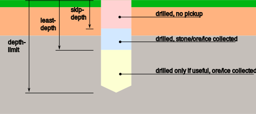

## Getting Started

1. Get a setup running with v0.9.68.
2. [Update](#update) to this version

(Sorry, did not have the time to write a tutorial yet.)

## Updating from v0.9.68 {update}

1. Recall all agents.
2. Remove the following commands from your startup scripts (Custom Data of the PBs). They are not supported any more,
	- `command:set-value:depth-limit` - Now set on the LCD screen menu.
	- `command:set-value:skip-depth` - Now set on the LCD screen menu.
	- `command:set-role` - Now determined by the script. (Separate scripts for agent and dispatcher.)
3. Copy dispatcher script to the dispatcher and recompile.
4. Copy the agent script to all agents and recompile.

## Definitions

### Task

A task is a collection of jobs (shafts), and is usually processed by a dispatcher.

### Job

A job is shaft, processed by an individual agent. The dispatcher will usually assign a job to the individual agents.

## Task Creation

1. Recall all agents, if a task is being processed. Any existing task will be overwritten by the new one.
2. Designate the location by one of the following methods:
   - TODO
3. The dispatcher will create the task using the following parameters.
   - TODO: shaft radius, agent group, location & orientation, #generations, max. depth, adaptive, skip-depth
4. The dispatcher will start dispatching jobs to the agents.

## Job Processing

An agent will drill down in two steps:
1. To the `skip-depth`, without taking on stone/ore/ice. (*)
2. Further to `least-depth`, picking up stone/ore/ice. 
3. On to `depth-limit`, but only if there is ore or ice.

(*) The agent actually takes on a some stone/ore/ice, but only into the inventory of the drills. These are disconnected from the conveyor system.

Note that `depth-limit` is stronger than `least-depth`, e.g. when the latter is greater than the former, the agent will stop at `depth-limit`. 

The following subsections contain parameter sets for typical mining tasks.

### Surface Ore

Mine ore that is on the surface. This is typical for asteroid deposits, or surface ice on planets.

- Set `skip-depth` to 0.
- Set `least-depth` to 0.
- Set `depth-limit` to a high value, e.g. 50 m. The agent will finish the shaft when there is no more ore/ice being picked up by the drills.

### Subsurface Ore

Mine ore that is below the surface, under a layer of dirt or rock.

First, drill a pilot shaft:
- Set `skip-depth` to 0 to a high value, depending on whether you want to pick up material from the pilot shaft.
- Set `least-depth` to the expected depth of the ore plus 5 m. The expected depth can be detected with an ore detector.
- Set `depth-limit` to `least-depth` plus 30 m.
- Use only 1 agent.

Observe at which depth the agent picks up useful ore. The value is displayed on the LCD GUI. Then:
- Set `skip-depth` to a 5 m  above the start of the ore.
- Set `least-depth` to the start of the ore, or slightly deeper (round to full 5m).
- Set `depth-limit` to the end of the ore, or slightly deeper.

### Two-layer Ore

Typically, there is ore below ice, sometimes with a layer of rock in between.

Proceed as with subsurface ore, but make sure that `least-depth` and `depth-limit` values are sufficiently high. So that the agent will drill through the deepest ore layer.

### Excavation

Sometimes you just want the mining drones to excavate a site.

Set `skip-depth`, `least-depth` and `depth-limit` to the same value.

### Adaptive Mining

## Logging

### Dispatcher

The dispatcher logs events to an LCD panel. The LCD panel should be a wide LCD, if possible. In order to connect an LCD screen to the dispatcher, execute the command `command:add-logger:my_lcd_name`, where `my_lcd_name` is the name of the LCD. 

The verbosity of the log can be controlled by changing the `logLevel` variable at the beginning of the dispatcher script. 

### Agent

TBD

## Adding Agents: Handshaking

Agents will broadcast a message on `miners.handshake` on startup. Any dispatcher in range can respond with a `miners.handshake.reply` message, and take the agent into its service. //TODO: Agents must confirm this with another message to avoid becoming the servant to multiple masters.

An agent will initiate a handshake when its PB is recompiled.

A dispatcher will broadcast `miners`/`dispatcher-change` when its PB is recompiled. All agents picking up that broadcast will forget about their master and start handshaking again! 

The handshake will fail, if agent and dispatcher run different software versions. The version can be found in the info box of the programmable block, or at the beginning of the code in variable `Ver`.

## Agent Commands

### `command:create-task`

Starts a mining task: 
1. Position the agent slightly above the center of the desired mining area.
2. On planets, the mining plane will start 5 m above the planet's surface. In space, the mining plane will start at the position of the agent.
3. On planets, the mining direction will be along the gravitational acceleration. In space, the drone's orientation will define the mining direction.
4. Run `command:create-task`.
5. The agent will sent its `circular-pattern-shaft-radius`, the normal vector and the center point of the mining task to the dispatcher in a `create-task` message. This is only at task proposal at this point.
6. The dispatcher may perform checks to validate the proposal.
7. The dispatcher starts the task, and instruct other agents to commence work. 
   1. Only agents of the same group as the designating agent will be used.
   2. The dispatcher will instruct all agents (even other groups!) to clear their storage state with a `miners.command` / `command:clear-storage-state` broadcast.
   3. The dispatcher will send the task's normal vector to all same-group agents with a `miners.normal` message.
   4. The dispatcher will send a `command` / `mine` message to all same-group agents.
8. The same-group agents will start mining ...

## Air Traffic Control (ATC)

ATC pevents collisions in mid-air. It grants permissions to the agents when it is safe for them to proceed into protected areas of the airspace.

Generally, agents move along horizontal planes, so called _flight levels_. Each agent has its own flight level.

Agents can also move vertically, accross the flight levels of other agents. This happens at the
mining site, or near the base. Agents must aquire a local airspace lock for that:

- Lock **`mining-site`**
  - The lock grants permission to traverse other flight levels at the mining site in a strictly vertical direction.
  - To grant this lock, all other agents must fulfill at least one of the following conditions:
	- The other agent is in its shaft (or at least below the get-above altitude of the current job).
	- The other agent is waiting at the intersection between its shaft and its flight level (e.g. end of returning to shaft).
	- The other agent is far away (1k), moving away or moving on a higher flight level.
- Lock **`base`**
  - The lock grants permission to traverse other flight levels at the base (docking ports) in a strictly vertical direction.
  - To grant this lock, all other agents must fulfill at least one of the following conditions:
	- The other agent is docked.
	- The other agent is waiting at the intersection between its approach corridor (cylinder above docking port) and its flight level.
	- The other agent is far away (1k), moving away or moving on a higher flight level.

Base and mining site must not overlap, or there will be undefined behaviour.

There are two more airspace locks, "general" and "force-finish", which have legacy or special functionalities.

## Protocol Messages

### Unicast

#### `apck.depart.approach` (ATC)

- Sent from the dispatcher to the agent, giving permission to take off.
- Contains a departure path ("flight plan").

#### `apck.depart.complete` (ATC)

- Sent from the agent to the dispatcher.
- The dispatcher can flag the docking port as available again.

#### `apck.depart.request` (ATC)

- Sent from the agent to the dispatcher to request permission to take off.
- The agent is supposed to wait. (e.g. state `MinerState.WaitingForDocking`)
- TODO: Never used???

#### `apck.docking.approach` (ATC)

- Sent from the dispatcher to the agent, assigning a free docking port.
- Contains an approach path ("flight plan").

#### `apck.docking.request` (ATC)

- Sent from the agent to the dispatcher to request permission to land.
- The agent is supposed to wait. (e.g. state ``)
- TODO

#### `apck.docking.approach` (ATC)

- Sent from the agent to the dispatcher.
- TODO

#### `apck.depart.approach` (ATC)

- Sent from the agent to the dispatcher.
- TODO

### `apck.ntv.update` (ATC/ILS)

- Sent from the dispatcher to the agent.
- Contains data about the assigned docking port, so that the agent can dock to a moving base (e.g. rover or ship).

#### `miners` (ATC)

- Sent from the dispatcher to the agent in response to a `common-airspace-ask-for-lock` broadcast, granting an airspace lock.
- The payload shall contain `common-airspace-lock-granted:<section>`.

#### `miners.handshake.reply` (Dispatching)

- Sent from the dispatcher to the agent in response to a broadcast to `miners.handshake`.
- Accepts the agent into its service.

#### `miners.normal` (Dispatching)

- Sent from the dispatcher to all agents of the current task group when starting a new task.
- Shall be sent before `command`/`mine`.
- Informs about the normal vector of the mining plane.

#### `miners.resume` (Dispatching)

- Sent from the dispatcher to all agents of the current task group.
- Instructs the agents to resume work.
- Payload is the normal vector to the mining plane.
- TODO: How do agents react?

#### `command`

- Sent from the dispatcher to the agent to issue a single command.
- The parameter contains the command to execute.
  - `mine` is sent when starting a new task. TODO: Will agents ask for a shaft assignment? 

#### `report.request` (Dispatching)

- Sent from the dispatcher to all agents to request a status report on their job.
- The status report is used for the GUI screen.
- Has no parameter.
- TODO: How do agents react?

### Broadcast

- Channel `miners.command` is used by the dispatcher to issue commands to the agents.
- Channel `miners.handshake` is used by the agents to announce their availability to potential dispatchers.
- Channel `miners` is used for air traffic control (ATC).
- Channel `miners.report` is used by the agents to transmit status reports.

#### `common-airspace-ask-for-lock` (ATC)

- Broadcasted from the agent on channel `miners`.
- Asks for takeoff permission to an airspace section.
- The dispatcher can grant the permission/lock by sending an unicast `miners` message with a `common-airspace-lock-granted` payload.

#### `common-airspace-lock-released` (ATC)

- Broadcasted from the agent on channel `miners`.
- Releases an airspace lock to the dispatcher.
- The dispatcher may grant the lock to another, waiting agent.

#### `command:halt`

- Broadcasted from the dispatcher on channel `miners.command`.
- Instructs the agents to halt and clear state. (Emergency Stop)
- TODO: How do agents react?

#### `command:clear-storage-state`

- Broadcasted from the dispatcher on channel `miners.command`.
- Instructs the agents to clear their internal state.

#### `command:dispatch` (Dispatching)

- Broadcasted from the dispatcher on channel `miners.command`.
- TODO
- Implements the "purge locks" functionality.

#### `command:force-finish` (Dispatching)

- Broadcasted from the dispatcher on channel `miners.command`.
- Instructs the agents to stop work and return to base.
- Implements the recall functionality.

#### `miners.handshake` (Dispatching)

- Broadcasted from the agent on channel `miners.handshake`.
- Agent announces itself as ready for deployment.
- Parameter is the group constraint of the agent.
- The dispatcher shall reply with unicast message `miners.handshake.reply` to accept the agent into its service.

