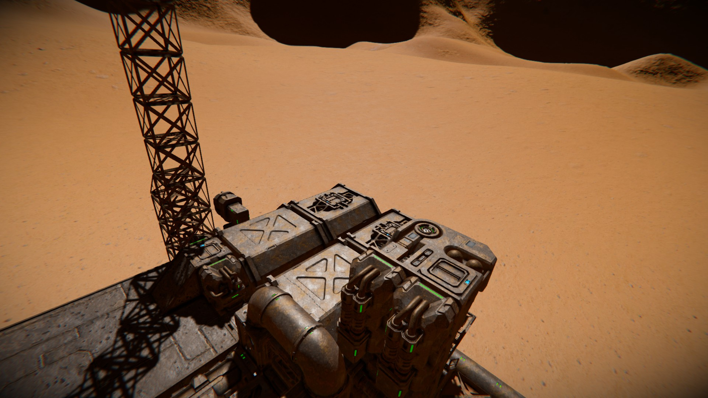

# Step 1:

1. Find a nice, flat pice of terrain.
2. Build a minimum sustainable base there. (Power, Container, Antenna)
3. Check the antenna range: At least 5km, depending on how far the mining site will be.

[Main Page](/Readme.md) | [Next Step](step2.md)

