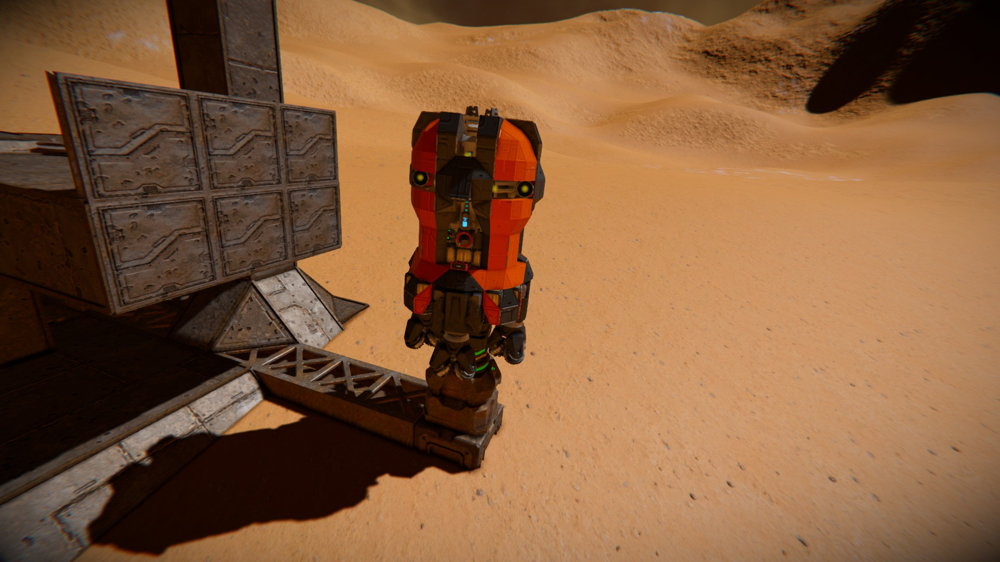

# Step 3:

1. Get a mining drone. In this tutorial, we will use the [XU-3](https://steamcommunity.com/sharedfiles/filedetails/?id=2790770110) by [pro100tv](https://steamcommunity.com/profiles/76561198127609350).
Note: We recommend against designing your own drone when you are new to SCAM.
2. Rename the drone's grid. (The drone's name will show in the GUI later.)
3. Check the drone's antenna range: At least 5km, depending on how far the mining site will be.
4. Make sure the drone is refueled and the batteries are charged.
5. Set the Custom Data of the drone's programmable block (PB). A typical script for the XU-3 looks like this:

```
command:set-value:circular-pattern-shaft-radius:3.6
command:add-panel:feed-panel
command:set-value:gas-low-factor:0.6
command:set-value:cargo-full-factor:0.85
```

6. Install [this script](/bin/script_agent.cs) on the drone's PB.
7. Connect the drone to the docking port at the base.

[Previous Step](step2.md) | [Next Step](step4.md)

