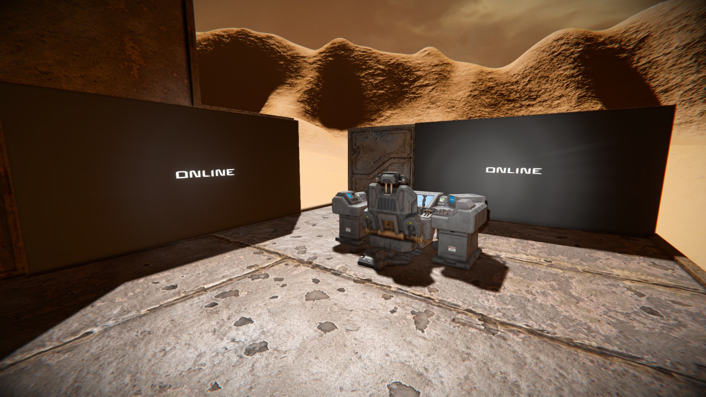

# Step 4:

1. Build 2 wide LCD screens and 1 Control Seat.
2. Rename one LCD screen `MiningCtrl GUI`.
3. Rename the other LCD screen `MiningCtrl Log`.
4. Rename the Control Seat `MiningCtrl Seat`.

[Previous Step](step3.md) | [Next Step](step5.md)

