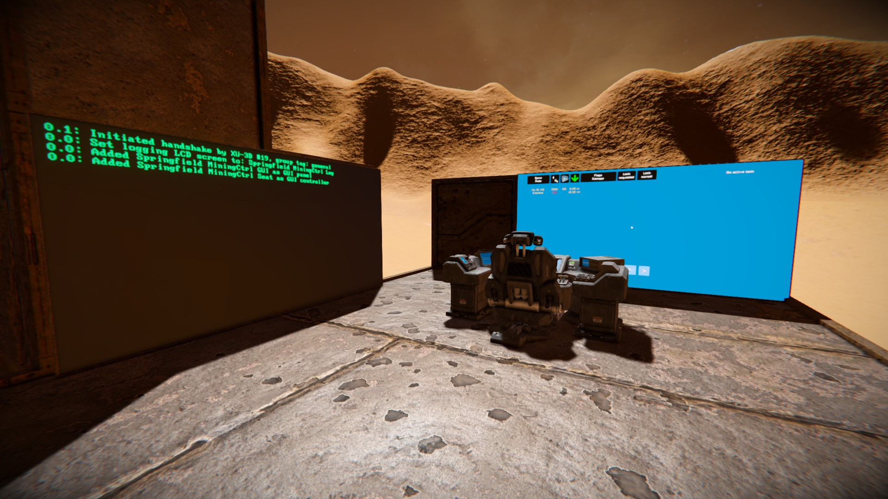

# Step 5:

1. Build a programmable block (PB) on your base.
2. Rename it to `SCAM Main Computer`.
3. Copy the following script into its Custom Data:

```
command:set-value:circular-pattern-shaft-radius:3.6
command:add-gui-controller:MiningCtrl Seat
command:add-panel:MiningCtrl GUI
command:add-logger:MiningCtrl Log
```

4. Install [this script](/bin/script_dispatcher.cs) on the PB.
5. Checkout the two LCDs. They should show some data. (For activating the GUI screen, sit in the Control Seat and wiggle the mouse.)
6. The drone should be shown on the GUI screen, along with some housekeeping data.

[Previous Step](step4.md) | [Next Step](step6.md)

