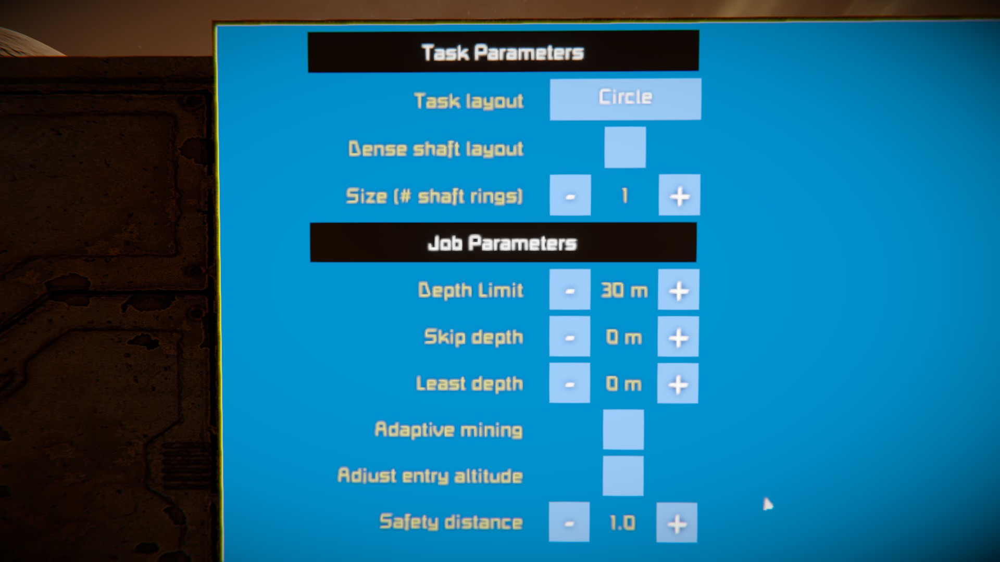

# Step 6:

1. Sitting in the Control Seat, move the mouse cursor and press `E` to drop a "click". (Mouse buttons do not work.)
2. Go to the task/job parameters page and set the following values:
	- `Size` = 1
	- `Depth Limit` = 30 m
	- `Safety Distance` = 1.0
3. Go to the airspace page and set the following values:
	- `Flight Level Stride` = 14 m
	- `Minimum Safe Altitude (MSA)` = 80 m

[Previous Step](step5.md) | [Next Step](step7.md)

